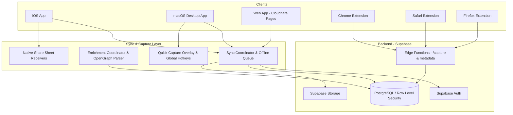

# laterbox Architecture & Technical Design

## Overview
**laterbox** is a cross-platform, privacy-focused bookmarking and read-it-later application built with Flutter, Supabase, and modern web standards. It enables users to capture articles, notes, URLs, images, and documents across iOS, macOS, Android, Web, and Browser Extensions with real-time sync and offline-first capabilities.

---

## High-Level System Architecture

---

## Core Components

### 1. Offline-First Synchronization (`lib/core/sync/`)
- **Local Cache**: Items are immediately persisted to local SQLite/Isar storage for instant UI updates.
- **Sync Coordinator**: Manages an idempotent change queue (`sync_queue`), handling conflicts and retrying network operations with exponential backoff.
- **Real-Time Sync**: Subscribes to Supabase real-time channels to reflect changes made from other devices or browser extensions instantly.

### 2. Smart Metadata Enrichment (`lib/core/enrichment/`)
- When a URL or article is captured, laterbox fetches OpenGraph metadata, website titles, descriptions, favicons, author details, and preview images.
- Background fallback enrichment handles sites that require custom scraping or headless parsing.

### 3. Native Desktop & System Integrations (`lib/core/desktop/`)
- **Global Shortcuts**: System-wide customizable hotkeys (default `Cmd+Shift+Space` or `Cmd+T`) trigger the Quick Capture modal from any active application.
- **Tray Service**: macOS menu bar tray with quick capture actions and status indicators.
- **Window Management**: Seamless window transition between floating capture bar and full inbox window.

### 4. Browser Extension Authentication (`lib/features/extension/`)
- **Cross-Platform Auth Flow**: Extensions connect to user accounts via a secure authorization handshake (`https://laterbox.micorp.pro/connect`), storing scoped session tokens in `chrome.storage.local`.
- **Sidepanel & Popup**: Native browser sidepanels and quick-popup windows for instant clipping without tab context switching.

---

## Database Schema (PostgreSQL + RLS)

- **`items`**: Primary table for saved links, notes, articles, and attachments with user isolation enforced by Row Level Security.
- **`tags` & `item_tags`**: Many-to-many relationship supporting tag autocompletion and organization.
- **`collections`**: Folders and nested grouping for archived or project-specific content.
- **`attachments`**: Binary assets (images, PDFs, documents) stored in Supabase Storage with signed URL access.
